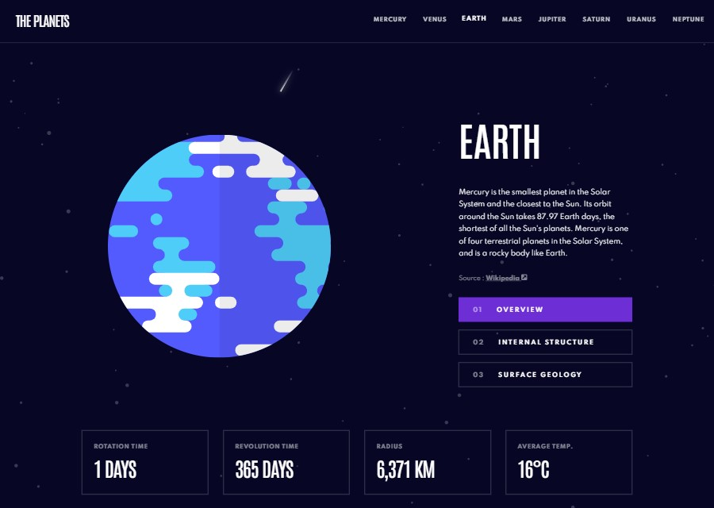

# Frontend Mentor - Planets fact site solution

This is a solution to the [Planets fact site challenge on Frontend Mentor](https://www.frontendmentor.io/challenges/planets-fact-site-gazqN8w_f). Frontend Mentor challenges help you improve your coding skills by building realistic projects.

## Table of contents

- [Overview](#overview)
  - [The challenge](#the-challenge)
  - [Screenshot](#screenshot)
  - [Links](#links)
- [My process](#my-process)
  - [Built with](#built-with)
  - [What I learned](#what-i-learned)
  - [Continued development](#continued-development)
  - [Useful resources](#useful-resources)
- [Author](#author)
- [Acknowledgments](#acknowledgments)

## Overview

### The challenge

Users should be able to:

- View the optimal layout for the app depending on their device's screen size
- See hover states for all interactive elements on the page
- View each planet page and toggle between "Overview", "Internal Structure", and "Surface Geology"

### Screenshot

### Links

- Solution URL: [Repository](https://github.com/kinjames/planet-fact-site)
- Live Site URL: [Github](https://kinjames.github.io/planet-fact-site/)

## My process

### Built with

- Semantic HTML5 markup
- CSS custom properties
- Scss
- Flexbox
- JavaScript

### Layout

The designs were created to the following widths:

- Mobile: 375px
- Desktop: 1140px

## Author

- Frontend Mentor - [@kinjames](https://www.frontendmentor.io/profile/kinjames)
- Twitter - [@TheBlackCoder7](https://twitter.com/TheBlackCoder7)
